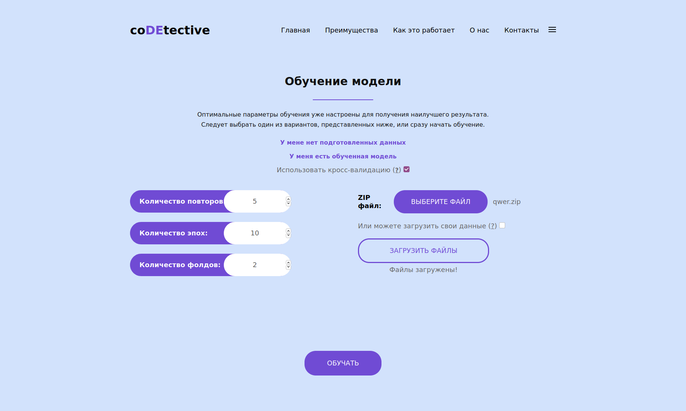
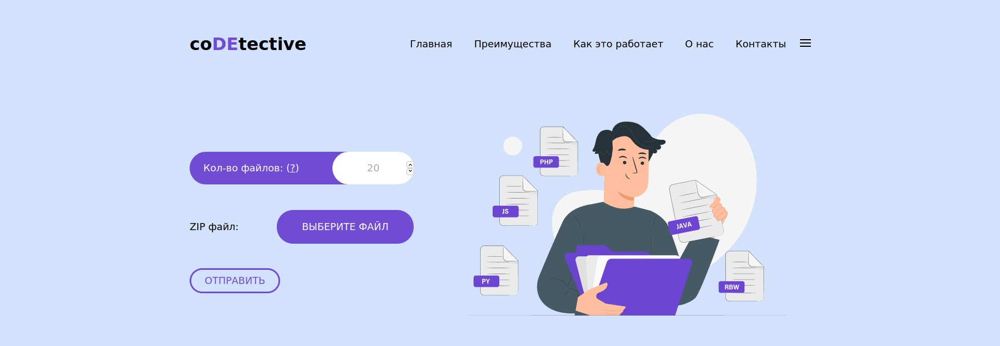
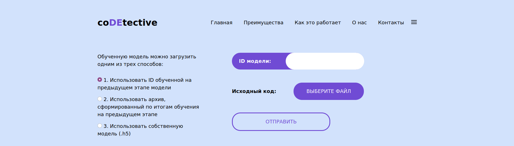

# codetective

Neural networks for source code authorship

### Установка Docker

Установка docker подробно описана [здесь](https://www.digitalocean.com/community/tutorials/how-to-install-and-use-docker-on-ubuntu-20-04-ru)

### Настройка и скачивание доп. файлов

Необходимо скачать [файл](https://drive.google.com/file/d/1v7sF29u28myrL72SA_Z4ObSlymlYtqc2/view?usp=sharing) и пометить его в папку:

#### backend/lib/python3.8/site-packages/tensorflow/python/

Сейчас это происходит автоматически в докерфале, надо следить, чтобы ссылка была та же
### Создание образа и контейнера

Необходимо создать образ. Для этого в папке, где находится docker-compose, выполнить:

```
docker-compose build
```

После этого запустить проект:

```
docker-compose up -d
```
(это займет некоторое время)

Если хотите посмотреть и удостовериться, что запуск проекта происходит корректно, то делайте это в нтерактивном режиме без опции -d

```
docker-compose up
```

Окончанием запуска можно считать строку:

```
backend_1   | Watching for file changes with StatReloader
```

Дождаться установки всех необходимых пакетов и перейти на http://адрес_вашего_сервера:3000

Если проект запущен на локальном компьютере, то перейдите по ссылке http://localhost:3000

Проверить работоспособность сервера: http://127.0.0.1:8000/api/train/

Остановить проект

```
docker-compose down
```

### Главная страница сайта


### Страница обучения моделей



### Страница создания наборов данных для обучения



### Страница предсказания плагиата по коду


